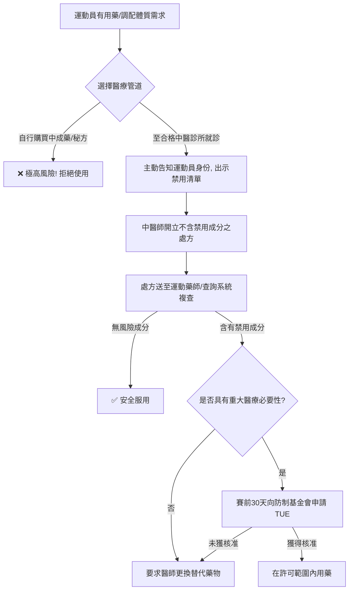

# 防範運動員誤服中藥禁藥的臨床與教育對策

## 📌 導言
鑑於中藥（Traditional Chinese Medicine, TCM）在亞洲運動員中的廣泛應用，以及近年（2021-2026）來因中藥導致的非故意運動禁藥事件頻發，學術界、臨床醫學界與防興奮劑機構共同研擬了多項**預防、篩查與教育對策**。

這些研究探討了如何透過跨學科合作（中醫師、運動藥師、隊醫），結合數位查詢工具與法律防護機制（治療用途豁免 TUE），將運動員誤服中藥禁藥的風險降至最低。

---

## 🏥 跨領域防護機制的建立：運動中醫師與運動藥師

### 1. 「運動中醫師」角色的興起
* **學術共識**：傳統中醫師在開立處方時，往往只關注藥材的配伍與療效（如清熱、活血），對 WADA 的禁用清單（特別是化學成分如去甲烏藥鹼、麻黃鹼等）缺乏足夠的敏感度。
* **臨床對策**：近年學術界積極推動「運動中醫師」培訓。合格的運動中醫師必須具備雙重知識：
  1. 熟知中醫辨證論治與傷科復原技術。
  2. 熟知 WADA 的最新禁用清單，並能辨識哪些中藥材含有 S3（如去甲烏藥鹼）、S6（如麻黃鹼）、S8（大麻素）等禁用化學成分，在開藥時進行避開或替代。

### 2. 「運動藥師」的處方雙重審查（Double-Check）
* **實務應用**：建立中藥處方審查流程。當運動員拿到中醫處方（包括單味藥材、複方或科學中藥）時，處方需提交給經過運動禁藥專業培訓的「運動藥師」進行篩查。
* **篩查重點**：運動藥師利用高解析度資料庫，分析處方中是否含有潛在禁藥成分，特別注意「中摻西」（中藥中非法添加西藥成分，如利尿劑、消炎藥）的檢驗報告。

---

## 📱 數位防禦：運動禁藥查詢系統之應用
數位化工具是降低運動員與教練資訊不對稱的最有效方法。

### 1. 中華運動禁藥防制基金會 (CTADA) 應用藥品資料庫
* **系統網址**：[CTADA 運動禁藥查詢系統](https://antidopingeducation.org.tw/system/)
* **功能介紹**：
  * **西藥查詢**：輸入商品名或化學成分，即可查詢是否為禁用物質。
  * **中藥查詢**：收錄了國內常用中藥材及科學中藥複方，輸入藥名（如葛根湯、細辛、蓮子心）即可顯示其安全評估結果。
  * **即時更新**：配合 WADA 每年 1 月 1 日生效的最新禁用清單進行即時更新。

### 2. 行動 App 與條碼掃描
學術研究指出，利用手機 App 在藥局或醫療院所進行條碼掃描，能讓選手在購買非處方藥或中成藥時，在第一時間判定安全性，此類工具已被證實能顯著降低自主備藥運動員的誤用率。

---

## ⚖️ 法律與行政防護：治療用途豁免 (TUE) 申請
當運動員基於重大醫療需求，**必須使用**含有禁用清單成分的藥物（包含某些中藥製劑）時，必須遵循以下學術與法規指引：

### 1. 什麼是治療用途豁免 (TUE, Therapeutic Use Exemptions)？
TUE 允許運動員在特定醫療狀況下，合法服用通常被禁用的藥物。若不申請而直接使用，藥檢呈陽性仍將被視為違規。

### 2. 中藥 TUE 申請的四大核心要求
根據《中華運動禁藥防制基金會》公佈之審查指引，中藥 TUE 申請極為嚴格，必須滿足以下條件：
1. **診斷與病歷**：必須由合格醫師開立診斷證明書，並附上詳細的病歷資料。
2. **明確標註成分**：**不接受「祖傳秘方」或標示不清的複方中藥申請**。申請表上必須明確寫出該藥物所含的 WADA 禁用化學物質名稱（例如：去甲烏藥鹼，而非僅寫蓮子心）。
3. **無替代方案證明**：必須證明若不使用該含有禁用成分之藥物，將對運動員的健康造成重大損害，且無其他不含禁藥成分的替代藥物（無論西藥或中藥）可用。
4. **提前申請**：除了緊急醫療狀況外，TUE 必須在**參賽前至少 30 天**提出申請，並在獲得 TUE 委員會書面核准後，方可開始用藥。

---

## 💡 總結：運動員「零風險」用藥決策流程

*本流程依據 2021-2026 運動醫學教育共識編製。*
