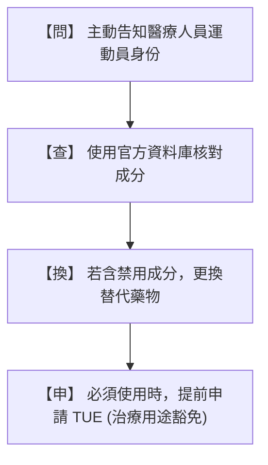

# 運動員中藥使用與運動禁藥風險防範指南

本指南旨在針對運動員、教練、防護員及臨床醫療人員，系統性剖析傳統中草藥（TCM）與科學中藥濃縮製劑在競技運動中的潛在禁藥風險。指南結合了 WADA / CTADA 2026 最新禁用清單、臨床藥物動力學排除數據、最新體壇判罰案例，並提供實務避雷工具。

---

## 壹、 中草藥的基本概念與禁藥法理

### 1.1 中草藥的多成分與複雜性
傳統中草藥（Traditional Chinese Medicine, TCM）源自植物、動物或礦物，其分子組成極為複雜。
*   **多成分特徵**：一味單方中藥材常含有數百種活性成分（如生物鹼、黃酮、皂苷等）；而由多味藥材組成的「複方煎劑」或市售「科學中藥（濃縮顆粒）」更是成分交織，其含量易受藥材產地、採收季節、炮製方法及濃縮製程的影響，具有顯著的波動性。
*   **科學中藥的隱性風險**：濃縮顆粒在萃取過程中會將活性成分放大數倍至數十倍，雖然提升了臨床療效，但同時也將微量的運動禁用成分累積至容易在尿檢中呈現陽性的濃度。

### 1.2 反運動禁藥之「嚴格責任原則」
世界運動禁藥管制組織（WADA）在其條例中明文規定了**「嚴格責任原則」（Strict Liability）**：
*   **客觀事實判定**：只要運動員的檢體（尿液或血液）中驗出禁用物質、其代謝物或生物標記，即構成運動禁藥違規（ADRV），無論運動員是故意、過失、疏忽，或是因治病、進補而誤服。
*   **免責難度高**：在聽證會上，「不知道中藥裡含有禁藥」或「中醫師/藥師開立處方時表示安全」均不能作為完全免責的理由，最多僅能作為爭取減輕禁賽期限的辯護事由。運動員必須對所有進入自己體內的物質負起終極責任。

---

## 貳、 運動員使用中草藥的臨床原因

運動員在長期的訓練與高強度競技中，常面臨肌肉損傷、慢性疼痛與生理機能波動，因而常尋求中藥進行調理。主要原因包括：

1.  **運動後疲勞恢復（補氣活血）**：
    *   高強度訓練會導致中醫所謂的「氣血兩虛」或「氣滯血瘀」。運動員常用**當歸、黃芪、人參、丹參**等補益與活血化瘀藥材，以促進微循環、加速乳酸代謝並縮短肌肉疲勞恢復期。
2.  **運動損傷與慢性關節肌肉疼痛之調理**：
    *   針對跌打損傷、韌帶拉傷、肌肉痠痛或慢性關節炎，常使用外敷（如麝香膏）或口服中藥複方（如獨活寄生湯、疏經活血湯）來消腫止痛、通絡祛風。
3.  **免疫力調節與日常體質調理**：
    *   在備賽期或面臨季節交替、出國參賽時，運動員易因壓力導致免疫力下降。常用玉屏風散或參苓白朮散來調理脾胃、預防感冒及維持生理機能穩定。

---

## 參、 含運動禁藥之中草藥成分解析

本章節為本指南的核心，詳細拆解中草藥中已確定禁用以及列入監控的關鍵化學成分：

### 3.1 確定為禁用物質（Confirmed Prohibited List）

根據 WADA / CTADA 2026 禁用清單，以下中草藥成分在藥檢中被嚴格禁止，並常引發藥檢陽性處分：

#### A. 去甲烏藥鹼 (Higenamine) ─ 類別 S3 $\beta_2$-致效劑（賽內外全時段禁用）
*   **藥理與檢測閾值**：去甲烏藥鹼具擴張支氣管及強心作用。WADA 訂定的尿液判定陽性閾值極低，僅為 **10 ng/mL**。
*   **天然中藥來源**：
    *   **蓮子心** (*Plumula Nelumbinis*)：含量極高，運動員即使飲用一杯蓮子心茶，亦會在數小時內導致尿液中去甲烏藥鹼濃度嚴重超標。
    *   **附子、烏頭** (*Aconitum* 屬)：如四逆湯、八味地黃丸中常用之溫裡藥。
    *   **細辛、吳茱萸**：常用於散寒止痛之方劑。
    *   **日常食品**：**釋迦**（番荔枝科水果）亦含有天然去甲烏藥鹼，賽前應避免大量食用。
*   **代謝前驅物新風險：烏藥鹼 (Coclaurine)**：
    *   根據 2025 年最新藥物動力學研究，Coclaurine 本身未被禁用，但人體口服後，會在體內脫甲基代謝轉化為 **Higenamine**，導致尿檢呈現陽性。
    *   富含 Coclaurine 的藥材包括：**肉桂** (Cinnamon bark)、**大棗** (Jujube)、**黃柏**、**Processed Aconite Root（炮附子）**。這使得葛根湯、十全大補湯等含有肉桂與大棗的常見方劑防護難度大幅提高。

#### B. 麻黃素類興奮劑 ─ 類別 S6 興奮劑（僅賽內禁用）
*   **藥理與檢測閾值**：麻黃鹼（Ephedrine）與偽麻黃鹼（Pseudoephedrine）能興奮中樞神經、收縮血管。尿液檢測閾值為 **10 $\mu$g/mL**。
*   **主要中藥來源**：
    *   **麻黃** (*Ephedrae Herba*)：感冒與氣喘常用藥。
    *   **半夏** (*Pinelliae Rhizoma*)：常含 L-麻黃鹼，廣泛用於二陳湯、溫膽湯等化痰止咳方劑中。
*   **科學中藥之累積排除動力學**（2026 臨床研究）：
    *   *單次服用*：口服單次劑量 2.5g 的葛根湯或小青龍湯，尿液中麻黃鹼峰值（Cmax）平均約為 3.90 ~ 4.35 $\mu$g/mL，未突破 10 $\mu$g/mL 閾值。
    *   *連續服用（累積效應）*：若**一日三次連續服用 3 天**，藥物在體內累積，尿液排泄的麻黃鹼濃度將飆升至 **13.73 $\mu$g/mL（小青龍湯組）** 及 **39.03 $\mu$g/mL（葛根湯組）**，均嚴重超標判定為陽性违規。

#### C. 其他禁用物質分類中藥
*   **鹿麝香 (Moschus) ─ 類別 S1 同化性物質（全時段禁用）**：
    *   天然麝香膏或口服麝香丸中，含有多種天然雄性素（Androgens）及其衍生物，外用貼布亦可透過皮膚吸收，導致尿液檢測中同化性類固醇超標。
*   **地膚子、防己 ─ 類別 S5 利尿劑與遮蔽劑（全時段禁用）**：
    *   此類中藥具強效利尿作用，運動員若企圖透過利尿稀釋尿液中的其他禁藥成分（即遮蔽效應），會因尿液比重異常或直接驗出相關利尿成分而違規。
*   **火麻仁 (Cannabis Semen) ─ 類別 S8 大麻素（賽內禁用）**：
    *   火麻仁為大麻的乾燥成熟種子，中醫常用於潤腸通便。雖然種子本身不含高濃度 THC，但若在收割或加工過程中受到大麻葉或花粉的**交叉污染**，運動員服用後會導致尿檢中四氫大麻酚 (THC) 陽性超標。
*   **馬錢子 ─ 類別 S6 興奮劑（賽內禁用）**：
    *   含有劇毒的**番木鼈鹼（Strychnine）**，能極度興奮脊髓反射，臨床稍有不慎即易引發全身強直性抽搐，WADA 嚴禁賽內使用。

---

### 3.2 監控計畫清單（WADA Monitoring Program）

WADA 的監控計畫（Monitoring Program）旨在監測目前「未禁用」但可能存在濫用趨勢、或作為未來禁用候選的物質。2025 至 2026 年與中藥、草本膳食補充劑及選手日常生活高度相關的監控對象包括：

1.  **特定刺激興奮劑（僅限賽內監控）**：
    *   **咖啡因 (Caffeine)**：存在於茶葉、咖啡及許多「提神中藥茶包」中。目前不禁用，但持續監控運動員的濫用數據。
    *   **尼古丁 (Nicotine)**：菸草與特定草本煙燻療法。
    *   **安非他酮 (Bupropion)**、**正交交感胺 (Synephrine，枳實/枳殼之辛弗林成分)**。
2.  **代謝調節劑與新技術監控（全時段監控）**：
    *   **Semaglutide / Tirzepatide 的生物標誌物**：隨著胰高血糖素樣肽-1 (GLP-1) 減重藥物風靡全球，WADA 正密切監控其在體育界（如需要快速減重的量級運動）的濫用情況。部分標榜快速瘦身的「草本減肥丸」可能非法摻雜此類成分。
    *   **Hypoxen**：一種抗缺氧藥物，用於提高高海拔或極限運動下的氧氣利用率。

---

## 肆、 未來挑戰及趨勢

### 4.1 運動補充劑與中藥的「非法摻假與交叉污染」
根據 2026 年 3 月發表的全球系統性回顧報告，膳食補充劑與草本中藥的「非法摻假（Adulteration）」已成全球防堵難點：
*   **高污染率**：全球市售標榜增肌、燃脂、提神的膳食補充劑與草本顆粒中，有 **9% 至 15% 含有未標示的 WADA 禁用成分**（如 SARMs、合成類固醇、隱性興奮劑等）。
*   **標籤欺騙性**：生產商為了追求快速見效，常在「純天然」草藥中故意添加合成西藥，且標籤上完全隱瞞，對選手防護構成極大挑戰。

### 4.2 對運動員生物護照 (ABP) 的血液學干擾
補血類中藥（如當歸、黃芪、丹參）能促進骨髓紅血球造血系統。
*   **RET% 異常預警**：人體連續服用 14 天後，網狀紅血球百分比（RET%）會呈現顯著的統計學上升。這種生理學波動極易被 ABP 演算法判定為「 atypical（異常）」，懷疑選手使用了 EPO（促紅血球生成素）或進行了輸血操弄，選手必須花費巨大心力進行科學舉證以排除指控。

### 4.3 臨床醫藥人員的「防制認知盲區」
2025 年針對醫療專家的調查顯示，**超過 40% 的醫學與藥學專家不知道「去甲烏藥鹼」是禁用物質**。這意味著如果沒有受過運動禁藥專業訓練的醫師開立中藥，極易將選手推入禁賽深淵。

---

## 伍、 附錄：防護避雷實務工具箱

### 5.1 常見中藥複方「禁用與安全替代」速查表

當運動員面臨常見病症需要中醫調理時，醫療人員可參考下表避開高風險禁用藥物，選擇安全的替代方案：

| 臨床病症 | ❌ 禁用/高風險複方（原因） | 🟢 安全替代複方建議 |
| :--- | :--- | :--- |
| **感冒、咳嗽** | **小青龍湯、葛根湯、麻杏甘石湯** （含有「麻黃」，具麻黃鹼 S6 興奮劑風險） **二陳湯、溫膽湯**（含半夏 L-麻黃鹼風險） | **銀翹散、桑菊飲、桂枝湯**（注意：桂枝湯中若含肉桂，臨賽期需注意 Coclaurine 轉化去甲烏藥鹼風險；純風熱感冒建議選用銀翹散） |
| **腰痛、關節痠痛**| **獨活寄生湯、疏經活血湯** （常含細辛、防己，具 S3 去甲烏藥鹼與 S5 利尿劑風險） **外用天然麝香膏**（具 S1 同化性物質風險） | **葛根劑（不含麻黃者）、八珍湯** 外用貼布改用**不含麝香**之非甾體抗炎藥（NSAID）貼布，或純薄荷消炎貼布。 |
| **痛經、婦科調理**| **少腹逐瘀湯** （含有官桂/肉桂，具 Coclaurine 代謝去甲烏藥鹼風險） | **溫經湯（去官桂/細辛版）、四物湯**（不含當歸活血高劑量版以避免 ABP 干擾） |
| **便秘調理** | **火麻仁丸** （種子製程具 S8 大麻素 THC 污染風險） | **承氣湯系列、蜜煎導法、增液湯** |

---

### 5.2 運動員醫療防護黃金口訣 ── 「問、查、換、申」執行步驟

不論是醫師處方還是選手用藥，均應落實以下四步流程：

1.  **【問】主動告知**：就醫時，運動員必須第一時間向醫師與藥師聲明：**「我是接受禁藥檢測的運動員，請幫我避開禁用物質。」**
2.  **【查】線上核對**：將處方中的每一味中藥單方、複方名稱，輸入**中華運動禁藥防制基金會 (CTADA)** 的「適用藥品查詢系統」進行核對。
3.  **【換】安全替代**：若查詢結果顯示含有「禁用」或「有風險」，應立即與醫師溝通，更換為無禁藥風險的同療效中藥或西藥處方（如參考「避雷速查表」）。
4.  **【申】合法申請**：若因嚴重傷病（如急性氣喘）臨床上必須使用含有禁用成分的藥物，且無其他替代方案時，必須在服藥前依法向 CTADA 申請**「治療用途豁免（TUE）」**，獲得核准後方可使用。
