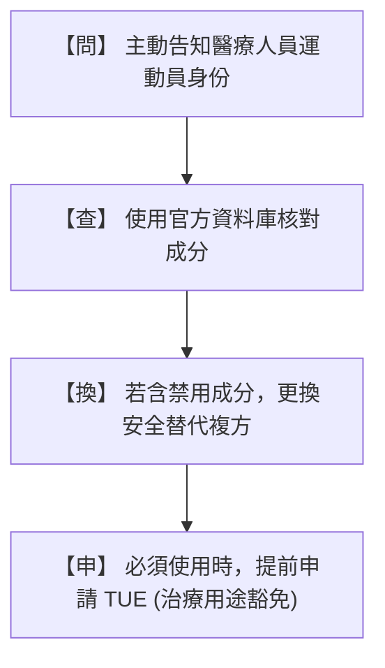
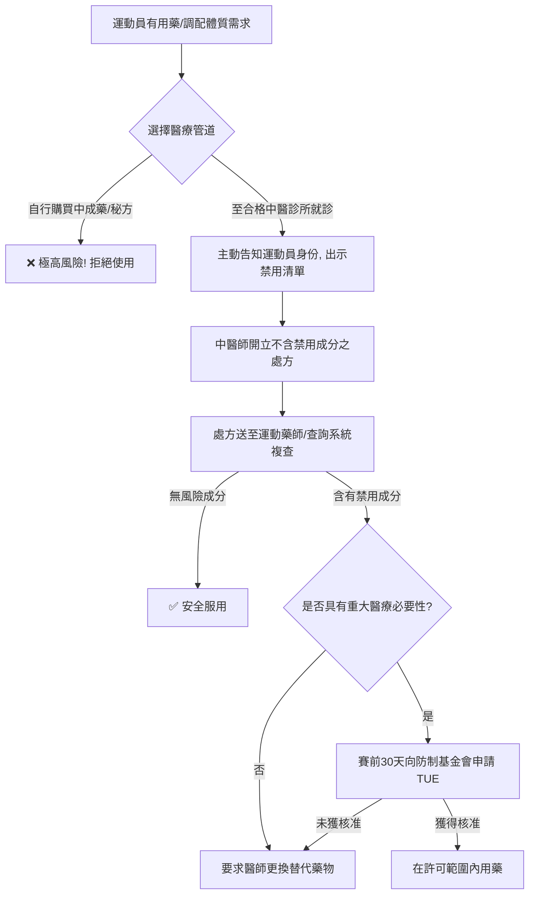

# 運動員中藥使用與運動禁藥風險防範指南 (v3.0 - 綜合整理版)

本指南旨在針對運動員、教練、防護員及臨床醫療人員，系統性剖析傳統中草藥（TCM）與科學中藥濃縮製劑在競技運動中的潛在禁藥風險。本指南深度整合了 WADA / CTADA 最新禁用清單、臨床藥代動力學數據、國際與國內體壇判罰真實案例，並提供臨床用藥安全替代方案與避雷實務工具箱。

---

## 一、 中草藥的基本概念與禁藥法理

### 1.1 中草藥的多成分與複雜性
傳統中草藥（Traditional Chinese Medicine, TCM）源自天然植物、動物或礦物，其分子組成極為複雜。
* **多成分特徵**：一味單方中藥材常含有數百種活性成分（如生物鹼、黃酮、皂苷等）；而由多味藥材組成的「複方煎劑」或市售「科學中藥（濃縮顆粒）」更是成分交織。其含量易受藥材產地、採收季節、炮製方法及濃縮製程的影響，具有顯著的波動性與天然變異性。
* **科學中藥的隱性風險**：濃縮顆粒在萃取與濃縮過程中，會將特定的化學成分放大數倍至數十倍。這雖然提升了臨床療效，但同時也將微量的運動禁用成分累積至容易在尿檢中呈現陽性的濃度。

### 1.2 反運動禁藥之「嚴格責任原則」
世界運動禁藥管制組織（WADA）在其條例中明文規定了**「嚴格責任原則」（Strict Liability）**：
* **客觀事實判定**：只要運動員的檢體（尿液或血液）中驗出禁用物質、其代謝物或生物標記，即構成運動禁藥違規（ADRV），無論運動員是故意、過失、疏忽，或是因治病、進補而誤服。
* **免責難度極高**：在聽證會上，「不知道中藥裡含有禁藥」或「中醫師/藥師開立處方時表示安全」均不能作為完全免責的理由。運動員必須對所有進入自己體內的物質負起終極責任。

---

## 二、 運動員使用中草藥的原因

運動員在長期的訓練與高強度競技中，常面臨肌肉損傷、慢性疼痛與生理機能波動，因而常尋求中藥進行調理。主要臨床原因與代表藥材包括：

1. **運動後疲勞恢復（補氣活血）**：
   * 高強度訓練會導致中醫所謂的「氣血兩虛」或「氣滯血瘀」。運動員常用**當歸、黃芪、人參、丹參**等補益與活血化瘀藥材，以促進微循環、加速乳酸代謝並縮短肌肉疲勞恢復期。
2. **運動損傷與慢性關節肌肉疼痛之調理**：
   * 針對跌打損傷、韌帶拉傷、肌肉痠痛或慢性關節炎，常使用外敷（如麝香膏）或口服中藥複方（如獨活寄生湯、疏經活血湯）來消腫止痛、通絡祛風。
3. **免疫力調節與日常體質調理**：
   * 在備賽期或面臨季節交替、出國參賽時，運動員易因壓力導致免疫力下降。常用**玉屏風散**或**參苓白朮散**來調理脾胃、預防感冒及維持生理機能穩定。

---

## 三、 含運動禁藥的中草藥

本章節為本指南的核心，詳細拆解中草藥中已確定禁用以及列入監控的關鍵化學成分，並融入體壇真實判罰案例與藥代動力學安全替代方案。

### 3.1 確定為禁用物質 (Confirmed Prohibited List)

根據 WADA / CTADA 禁用清單，以下中草藥成分在藥檢中被嚴格禁止，並常引發藥檢陽性處分：

#### A. 去甲烏藥鹼 (Higenamine) ─ 類別 S3 $\beta_2$-致效劑（賽內外全時段禁用）
* **藥理與檢測閾值**：去甲烏藥鹼具擴張支氣管及強心作用。WADA 訂定的尿液判定陽性閾值極低，僅為 **\(10\text{ ng/mL}\)**。
* **天然中藥來源**：
  * **蓮子心** (*Plumula Nelumbinis*)：含量極高，運動員即使飲用一杯蓮子心茶，亦會在數小時內導致尿液中去甲烏藥鹼濃度嚴重超標。
  * **附子、烏頭、川烏、草烏** (*Aconitum* 屬)：如四逆湯、八味地黃丸中常用之溫裡藥。
  * **細辛、吳茱萸**：常用於散寒止痛之方劑。
  * **南天竹子**：常用於止咳平喘（日本常用於止咳喉糖）。
* **日常食品與加工副產物風險**：
  * **釋迦**（番荔枝科水果）天然含有去甲烏藥鹼，臨賽前應避免大量食用。
  * 科隆反興奮劑實驗室研究指出，運動員常用於促進耐力的**甜菜根加工食品/補充品**（如甜菜根汁、甜菜根粉）中亦檢出了去甲烏藥鹼，推測為特定工業加工、發酵或高溫處理過程中產生的副產物。
* **代謝前驅物新風險：烏藥鹼 (Coclaurine)**：
  * 根據 2025 年最新藥物動力學研究，Coclaurine 本身未被禁用，但口服後人體內的肝臟代謝酶（如脫甲基酶）會將其在體內轉化為 **Higenamine**，導致尿檢呈現陽性超標。
  * 富含 Coclaurine 的藥材包括：**肉桂** (Cinnamon bark)、**大棗** (Jujube)、**黃柏**、**炮附子**、**木蘭皮**。這使得葛根湯、十全大補湯等含有肉桂與大棗的常見方劑防護難度大幅提高。

> [!WARNING]
> ### 🚨 【去甲烏藥鹼相關真實案例】
>
> **案例一：香港田徑選手 杜婉筠 ── 中藥調理案 (2022)**
> * **檢出禁用物質**：去甲烏藥鹼 (Higenamine)
> * **誤服原因**：杜婉筠（香港女子鉛球與鐵餅紀錄保持人）在賽前為了調理身體與治療肌肉痠痛，前往普通中藥鋪開立並服用了傳統中草藥製劑，而該中藥配方中含有含去甲烏藥鹼的藥材（如細辛或附子）。
> * **處分**：被香港反興奮劑組織（HKADC）處以**禁賽兩年**的重罰，取消其所有賽事成績、獎牌與積分。
>
> **案例二：肯亞馬拉松選手 Philip Kangogo ── 傳統草藥茶案 (2019)**
> * **檢出禁用物質**：去甲烏藥鹼 (Higenamine)
> * **誤服原因**：選手在聽證會上抗辯，表示自己在賽前因感冒不適，服用了其母親在家中為他熬煮的當地傳統草藥茶，對其中含有禁藥成分完全不知情。
> * **處分**：田徑誠信委員會（AIU）重申「嚴格責任原則」，駁回其完全免責申請，處以**禁賽兩年**處分。這證明不論是家庭偏方或民俗草藥，均非免責的避風港。
>
> **案例三：美國舉重選手 Matthew McCullough ── 草本補充劑交叉污染案 (2019)**
> * **檢出禁用物質**：去甲烏藥鹼 (Higenamine) 暨微量克倫特羅 (Clenbuterol，即瘦肉精) ─ 全時段禁用。
> * **誤服原因**：美國反禁藥機構（USADA）化驗證實，其服用的一款「全天然草本提神膳食補充劑」在生產過程中遭受了嚴重的未標示成分污染（Cross-contamination）。
> * **處分**：USADA 認定選手非故意使用，但因產品未經第三方禁藥篩檢認證，選手仍須承擔疏忽責任，被處以**禁賽 20 個月**處分。

---

#### B. 麻黃素類興奮劑 ─ 類別 S6 興奮劑（僅賽內禁用）
* **藥理與檢測閾值**：麻黃鹼（Ephedrine）與偽麻黃鹼（Pseudoephedrine）能興奮中樞神經、收縮血管。尿液檢測閾值為 **\(10\ \mu\text{g/mL}\)**（偽麻黃鹼為 \(150\ \mu\text{g/mL}\)）。
* **主要中藥來源**：
  * **麻黃** (*Ephedrae Herba*)：感冒與氣喘常用藥。
  * **半夏** (*Pinelliae Rhizoma*)：常含 L-麻黃鹼，廣泛用於二陳湯、溫膽湯等化痰止咳方劑中。
* **科學中藥之累積排除動力學**：
  * *單次服用*：口服單次劑量 2.5g 至 3.0g 的葛根湯或小青龍湯（含麻黃鹼約 5-10 mg），尿液中麻黃鹼峰值（Cmax）平均約為 \(2\sim5\ \mu\text{g/mL}\)，低於 \(10\ \mu\text{g/mL}\) 閾值，且通常於 24 小時內衰減。
  * *連續服用（累積效應）*：由於麻黃鹼半衰期為 5-8 小時，若**一日三次連續服用 3 天**，藥物在體內累積，尿液排泄的麻黃鹼濃度有 **60% 以上的機率突破 10 \(\mu\text{g/mL}\) 臨界值**，排泄峰值將飆升至 **\(13.73\ \mu\text{g/mL}\)（小青龍湯組）** 及 **\(39.03\ \mu\text{g/mL}\)（葛根湯組）**，嚴重超標。
* **尿液酸鹼度（pH 值）的代謝干擾**：
  * 麻黃鹼為弱鹼性藥物。當選手尿液呈**鹼性**（pH > 7.0，例如大量攝取蔬菜或小蘇打水）時，腎小管對麻黃鹼的重吸收增加，會導致藥物在體內的累積加劇、排除速度減慢，延長了超標風險期。

> [!WARNING]
> ### 🚨 【麻黃鹼相關真實案例】
>
> **案例四：台灣網球選手 曹家宜 ── 市售感冒藥誤服案 (2025)**
> * **檢出禁用物質**：甲基麻黃鹼 (Methylephedrine) ─ 類別 S6 興奮劑（賽內禁用）。
> * **誤服原因**：選手在賽前因感冒不適，服用了從日本購買的市售綜合感冒藥。日本與台灣許多市售非處方感冒藥中均含有「麻黃」提取物或「甲基麻黃鹼」以緩解鼻塞咳嗽。
> * **處分與影響**：選手自願接受暫時停賽以配合國際網球誠信調查機構（ITIA）的調查，痛失多場國際積分賽事。這突顯出即使是合法市售的西藥或草本成藥，在賽內檢測均極具風險。

---

> [!TIP]
> ### 🟢 【運動員安全替代用藥與停藥方案】
> 根據臨床藥代動力學研究，為避免麻黃鹼在體內蓄積超標，若運動員出現呼吸道或感冒症狀，應避開含麻黃與半夏的複方，改用以下安全的替代中藥複方：
>
> | 常見高風險複方（原因） | 臨床適應症 | 禁藥風險成分 | 🟢 安全替代中藥複方建議 |
> | :--- | :--- | :--- | :--- |
> | **葛根湯** | 感冒發熱、項背酸痛 | 麻黃鹼、偽麻黃鹼 | **桂枝湯**、**銀翹散**（適用於感冒初期解表，不含麻黃） |
> | **小青龍湯** | 外感風寒、咳嗽氣喘、痰多 | 麻黃鹼、細辛（去甲烏藥鹼） | **止嗽散**、**二陳湯**（宣肺化痰止咳，安全性高） |
> | **麻杏甘石湯** | 邪熱壅肺、身熱咳喘 | 麻黃鹼 | **桑菊飲**、**清肺湯**（清熱宣肺，不含麻黃成分） |
> | **防風通聖散** | 蕁麻疹、感冒蘊熱、便秘 | 麻黃鹼 | **防風沖劑**、**黃連解毒湯**配合其他潤腸中藥 |
>
> * **停藥期（Washout Period）建議**：若曾因病服用含麻黃之中藥複方，為確保尿檢完全低於 \(10\ \mu\text{g/mL}\) 門檻，建議**賽前至少 7 至 10 天必須完全停藥**；個體代謝慢者建議賽前 2 週（14 天）完全停藥。

---

#### C. 其他禁用物質分類中藥
* **鹿麝香 (Moschus) ─ 類別 S1 同化性物質（全時段禁用）**：
  * 天然麝香膏或口服麝香丸中，含有多種天然雄性素（Androgens）及其衍生物，外用貼布亦可透過皮膚吸收，導致尿液檢測中同化性類固醇超標。
* **地膚子、防己 ─ 類別 S5 利尿劑與遮蔽劑（全時段禁用）**：
  * 此類中藥具強效利尿作用，運動員若企圖透過利尿稀釋尿液中的其他禁藥成分（即遮蔽效應），會因尿液比重異常或直接驗出相關利尿成分而違規。
* **火麻仁 (Cannabis Semen) ─ 類別 S8 大麻素（賽內禁用）**：
  * 火麻仁為大麻的乾燥成熟種子，中醫常用於潤腸通便。雖然種子本身不含高濃度 THC，但若在收割或加工過程中受到大麻葉或花粉的**交叉污染**，運動員服用後會導致尿檢中四氫大麻酚 (THC) 陽性超標。
* **馬錢子 ─ 類別 S6 興奮劑（賽內禁用）**：
  * 含有劇毒的**番木鼈鹼（Strychnine）**，能極度興奮脊髓反射，臨床稍有不慎即易引發全身強直性抽搐，WADA 嚴禁賽內使用。

---

### 3.2 監控計畫清單 (WADA Monitoring Program)

WADA 的監控計畫（Monitoring Program）旨在監測目前「未禁用」但可能存在濫用趨勢、或作為未來禁用候選的物質。2025 至 2026 年與中藥、草本膳食補充劑及選手日常生活高度相關的監控對象包括：

1. **特定刺激興奮劑（僅限賽內監控）**：
   * **咖啡因 (Caffeine)**：存在於茶葉、咖啡及許多「提神中藥茶包」中。目前不禁用，但持續監控運動員的濫用數據。
   * **尼古丁 (Nicotine)**：菸草與特定草本煙燻療法。
   * **正交交感胺 (Synephrine)**：又名辛弗林，存在於**枳實、枳殼**等中藥材中，具輕微興奮作用。
2. **代謝調節劑與新技術監控（全時段監控）**：
   * **GLP-1 受體致效劑生物標誌物**：隨著 **Semaglutide / Tirzepatide** 等減重藥物風靡全球，WADA 正密切監控其在體育界（如需要快速減重的量級運動）的濫用情況。部分標榜快速瘦身的「草本減肥丸」可能非法摻雜此類西藥成分。
   * **Hypoxen**：一種抗缺氧藥物，用於提高高海拔或極限運動下的氧氣利用率。

---

## 四、 未來挑戰及趨勢

### 4.1 運動補充劑與中藥的「非法摻假與交叉污染」
根據 2026 年最新全球系統性回顧報告（Paper 5），膳食補充劑與草本中藥的「非法摻假（Adulteration）」已成全球防制難點：
* **高污染率**：全球市售標榜增肌、燃脂、提神的膳食補充劑與草本顆粒中，有 **9% 至 15% 含有未標示的 WADA 禁用成分**（如 SARMs、合成類固醇、隱性興奮劑等）。
* **標籤欺騙性**：生產商為了追求快速見效，常在「純天然」草藥中故意添加合成西藥，且標籤上完全隱瞞，對選手防護構成極大挑戰。
* **第三方篩檢認證**：運動員購買補充劑前，必須確認該產品是否通過 **Informed-Choice**、**NSF Certified for Sport** 或 **Cologne List（科隆名單）** 等第三方機構的逐批篩檢認證。

### 4.2 對運動員生物護照 (ABP) 的血液學干擾
ABP 血液學模組主要監控與攜氧能力相關的指標（如血紅素 Hb、網狀紅血球百分比 RET%、OFF-score 異常血液剖面評分），以防範血液性禁藥。
* **生血機制的干擾**：當歸（含有當歸多醣 ASP 具擬 EPO 活性）、黃芪（促進內源性 EPO 合成）、丹參（改善微循環、降低血液粘稠度）為中醫常用補血活血藥。
* **RET% 異常預警 (ATPF)**：高醫大團隊研究（Paper 1）證實，人體連續服用 14 天後，**網狀紅血球百分比（RET%）會呈現顯著的統計學上升**。這種生理學波動極易被 ABP 貝氏統計模型判定為「異常 (ATPF)」，懷疑選手使用了 EPO 或進行了輸血操弄。
* **選手防護對策**：選手在接受藥檢時，務必在**「禁藥檢查表」（Doping Control Form）**上詳實填寫過去 7 天內服用的所有中藥與保健品，以供 ABP 專家小組審查時進行科學排除。

### 4.3 臨床醫藥人員的「防制認知盲區」
根據 2025 年調查（Paper 3），臨床與藥學專家對運動禁藥的防範意識存有盲區：
* **知識盲區顯著**：**超過 40% 的受訪醫療專家不知道「去甲烏藥鹼」是禁用物質**。此外，高達 70% 的醫藥人員在校期間從未接受過系統性的運動禁藥防制訓練。
* **跨領域防護機制的建立**：近年積極推動具備 WADA 禁藥知識的**「運動中醫師」**培訓，並結合**「運動藥師」**進行處方雙重審查（Double-Check），建立運動員用藥諮詢的守門人（Gatekeeper）機制。

---

## 五、 附錄：防護避雷實務工具箱

### 5.1 運動員醫療防護黃金口訣 ── 「問、查、換、申」執行步驟

不論是醫師處方還是選手用藥，均應落實以下四步流程：

1. **【問】主動告知**：就醫時，運動員必須第一時間向醫師與藥師聲明：**「我是接受禁藥檢測的運動員，請幫我避開禁用物質。」**
2. **【查】線上核對**：將處方中的每一味中藥單方、複方名稱，輸入**中華運動禁藥防制基金會 (CTADA)** 的「適用藥品查詢系統」進行核對。
3. **【換】安全替代**：若查詢結果顯示含有「禁用」或「有風險」，應立即與醫師溝通，更換為無禁藥風險的同療效中藥（如參考本指引中的「安全替代中藥複方表」）。
4. **【申】合法申請**：若因嚴重傷病（如急性氣喘）臨床上必須使用含有禁用成分的藥物，且無其他替代方案時，必須在服藥前依法向 CTADA 申請**「治療用途豁免（TUE）」**，獲得核准後方可使用。

#### 運動員「零風險」用藥決策流程圖

### 5.2 中藥 TUE 申請的四大核心要求

根據《中華運動禁藥防制基金會》公佈之審查指引，中藥 TUE 申請極為嚴格，必須滿足以下條件：
1. **診斷與病歷**：必須由合格醫師開立診斷證明書，並附上詳細的病歷資料。
2. **明確標註成分**：不接受「祖傳秘方」或標示不清的複方中藥申請。申請表上必須明確寫出該藥物所含的 WADA 禁用化學物質名稱（例如：去甲烏藥鹼，而非僅寫蓮子心）。
3. **無替代方案證明**：必須證明若不使用該含有禁用成分之藥物，將對運動員的健康造成重大損害，且無其他不含禁藥成分的替代藥物（無論西藥或中藥）可用。
4. **提前申請**：除了緊急醫療狀況外，TUE 必須在**參賽前至少 30 天**提出申請，並在獲得 TUE 委員會書面核准後，方可開始用藥。
